<!-- AGENTTEAMS:BEGIN content v=1 -->
# ResearchTeam — Agent Team Topology

> **Auto-generated.** Regenerated on every `build_team.py` run.
> Do not edit manually — changes will be overwritten.

---

## Team Topology Graph

```mermaid
flowchart LR
    classDef governance fill:#e8e8ff,stroke:#6666cc,color:#000
    classDef domain    fill:#e8ffe8,stroke:#66aa66,color:#000
    classDef expert    fill:#fff8e8,stroke:#ccaa44,color:#000
    classDef tool      fill:#ffe8e8,stroke:#cc6666,color:#000
    classDef unknown   fill:#f5f5f5,stroke:#999,color:#000
    adversarial["Adversarial"]
    class adversarial governance
    agent_refactor["Agent Refactor"]
    class agent_refactor governance
    agent_updater["Agent Updater"]
    class agent_updater governance
    cleanup["Cleanup"]
    class cleanup governance
    code_hygiene["Code Hygiene"]
    class code_hygiene governance
    cohesion_repairer["Cohesion Repairer"]
    class cohesion_repairer domain
    conclusion_expert["Conclusion and Executive Summary Expert"]
    class conclusion_expert workstream_expert
    conflict_auditor["Conflict Auditor"]
    class conflict_auditor governance
    conflict_resolution["Conflict Resolution"]
    class conflict_resolution governance
    content_enricher["Content Enricher"]
    class content_enricher domain
    format_converter["Format Converter"]
    class format_converter domain
    git_operations["Git Operations"]
    class git_operations governance
    literature_review_expert["Literature Review Expert"]
    class literature_review_expert workstream_expert
    main_analysis_expert["Main Analysis Expert"]
    class main_analysis_expert workstream_expert
    navigator["Navigator"]
    class navigator governance
    orchestrator["Orchestrator"]
    class orchestrator governance
    output_compiler["Output Compiler"]
    class output_compiler domain
    primary_producer["Primary Producer"]
    class primary_producer domain
    quality_auditor["Quality Auditor"]
    class quality_auditor domain
    reference_manager["Reference Manager"]
    class reference_manager domain
    repo_liaison["Repo Liaison"]
    class repo_liaison governance
    security["Security"]
    class security governance
    team_builder["Team Builder"]
    class team_builder governance
    technical_validator["Technical Validator"]
    class technical_validator domain
    tool_doc_researcher["Tool Documentation Researcher"]
    class tool_doc_researcher tool_specialist
    tool_pandoc["CLI Tool Specialist"]
    class tool_pandoc tool_specialist
    topic_scoping_expert["Topic Scoping and Research Plan Expert"]
    class topic_scoping_expert workstream_expert
    visual_designer["Visual Designer"]
    class visual_designer domain
    work_summarizer["Work Summarizer"]
    class work_summarizer domain
    orchestrator -->|"Produce / Revise Deliverable"| primary_producer
    orchestrator -->|"Audit Quality"| quality_auditor
    orchestrator -->|"Repair Cohesion"| cohesion_repairer
    orchestrator -->|"Validate Technical Accuracy"| technical_validator
    orchestrator -->|"Convert / Transform Output"| format_converter
    orchestrator -->|"Manage References / Dependencies"| reference_manager
    orchestrator -->|"Compile Final Output"| output_compiler
    orchestrator -->|"Generate / Revise Diagram"| visual_designer
    orchestrator -->|"Navigate Project"| navigator
    orchestrator -->|"Security Review"| security
    orchestrator -->|"Code Hygiene Audit"| code_hygiene
    orchestrator -->|"Adversarial Review"| adversarial
    orchestrator -->|"Conflict Audit"| conflict_auditor
    orchestrator -->|"Resolve Conflicts"| conflict_resolution
    orchestrator -->|"Clean Up Artifacts"| cleanup
    orchestrator -->|"Update Agent Docs"| agent_updater
    orchestrator -->|"Refactor Agent Docs"| agent_refactor
    orchestrator -->|"Cross-Repository Liaison"| repo_liaison
    orchestrator -->|"Summarize Work Period"| work_summarizer
    orchestrator -->|"Git Operations"| git_operations
    navigator -->|"Return to Orchestrator"| orchestrator
    security -->|"Return to Orchestrator"| orchestrator
    code_hygiene -->|"Security Clearance (for Deletions)"| security
    code_hygiene -->|"Cleanup Agent"| cleanup
    code_hygiene -->|"Agent Refactor (Structural Violations)"| agent_refactor
    code_hygiene -->|"Log Conflict"| conflict_auditor
    code_hygiene -->|"Return to Orchestrator"| orchestrator
    adversarial -->|"Return to Orchestrator"| orchestrator
    adversarial -->|"Audit for Conflicts"| conflict_auditor
    conflict_auditor -->|"Return to Orchestrator"| orchestrator
    conflict_auditor -->|"Update Agent Docs"| agent_updater
    conflict_auditor -->|"Resolve Conflicts"| conflict_resolution
    conflict_auditor -->|"Verify Source Drift"| technical_validator
    conflict_auditor -.-> conflict_resolution
    conflict_auditor -.-> agent_updater
    conflict_auditor -.-> technical_validator
    conflict_resolution -->|"Return to Orchestrator"| orchestrator
    conflict_resolution -->|"Update Agent Docs"| agent_updater
    cleanup -->|"Return to Orchestrator"| orchestrator
    agent_updater -->|"Refactor Agent Docs"| agent_refactor
    agent_updater -->|"Run Adversarial Review"| adversarial
    agent_updater -->|"Run Conflict Audit"| conflict_auditor
    agent_updater -->|"Return to Orchestrator"| orchestrator
    agent_updater -.-> adversarial
    agent_updater -.-> conflict_auditor
    agent_updater -.-> agent_refactor
    agent_refactor -->|"Run Conflict Audit"| conflict_auditor
    agent_refactor -->|"Return to Orchestrator"| orchestrator
    agent_refactor -.-> conflict_auditor
    repo_liaison -->|"Return to Orchestrator"| orchestrator
    repo_liaison -->|"Security Review for Cross-Repo Write"| security
    repo_liaison -->|"Conflict Audit After Cross-Repo Change"| conflict_auditor
    git_operations -->|"Return to Orchestrator"| orchestrator
    git_operations -->|"Security Review"| security
    git_operations -->|"Conflict Resolution"| conflict_resolution
    git_operations -->|"Update Agent Docs"| agent_updater
    work_summarizer -->|"Verify Summary Accuracy"| technical_validator
    work_summarizer -->|"Run Adversarial Audit"| adversarial
    work_summarizer -->|"Run Conflict Audit"| conflict_auditor
    work_summarizer -->|"Return to Orchestrator"| orchestrator
    work_summarizer -.-> technical_validator
    work_summarizer -.-> adversarial
    work_summarizer -.-> conflict_auditor
    primary_producer -->|"Cohesion Audit"| cohesion_repairer
    primary_producer -->|"Quality Audit"| quality_auditor
    primary_producer -->|"Conflict Audit"| conflict_auditor
    primary_producer -->|"Return to Orchestrator"| orchestrator
    primary_producer -.-> cohesion_repairer
    primary_producer -.-> quality_auditor
    primary_producer -.-> conflict_auditor
    quality_auditor -->|"Route Corrections to Primary Producer"| primary_producer
    quality_auditor -->|"Route Cohesion Failures"| cohesion_repairer
    quality_auditor -->|"Return to Orchestrator"| orchestrator
    quality_auditor -.-> primary_producer
    quality_auditor -.-> cohesion_repairer
    cohesion_repairer -->|"Quality Re-Check"| quality_auditor
    cohesion_repairer -->|"Return to Orchestrator"| orchestrator
    cohesion_repairer -.-> quality_auditor
    technical_validator -->|"Route Corrections to Primary Producer"| primary_producer
    technical_validator -->|"Route Reference Issues"| reference_manager
    technical_validator -->|"Log Conflict"| conflict_auditor
    technical_validator -->|"Return to Orchestrator"| orchestrator
    technical_validator -.-> primary_producer
    technical_validator -.-> reference_manager
    technical_validator -.-> conflict_auditor
    format_converter -->|"Pass to Output Compiler"| output_compiler
    format_converter -->|"Quality Check After Conversion"| quality_auditor
    format_converter -->|"Return to Orchestrator"| orchestrator
    format_converter -.-> output_compiler
    format_converter -.-> quality_auditor
    reference_manager -->|"Run Conflict Audit"| conflict_auditor
    reference_manager -->|"Return to Orchestrator"| orchestrator
    reference_manager -.-> conflict_auditor
    output_compiler -->|"Convert Missing Components"| format_converter
    output_compiler -->|"Validate Technical Accuracy"| technical_validator
    output_compiler -->|"Return to Orchestrator"| orchestrator
    output_compiler -.-> format_converter
    output_compiler -.-> technical_validator
    visual_designer -->|"Convert Figure Format"| format_converter
    visual_designer -->|"Quality Check Figure"| quality_auditor
    visual_designer -->|"Return to Orchestrator"| orchestrator
    visual_designer -.-> format_converter
    visual_designer -.-> quality_auditor
    tool_doc_researcher -->|"Update Brief and Generated Docs"| agent_updater
    tool_doc_researcher -->|"Return to Orchestrator"| orchestrator
    tool_pandoc -->|"Validate Tool Output"| technical_validator
    tool_pandoc -->|"Security Clearance for Config Change"| security
    tool_pandoc -->|"Return to Orchestrator"| orchestrator
    tool_pandoc -.-> technical_validator
    tool_pandoc -.-> security
    topic_scoping_expert -->|"Vet Brief Before Drafting"| adversarial
    topic_scoping_expert -->|"Send to Primary Producer"| primary_producer
    topic_scoping_expert -->|"Verify Citations"| reference_manager
    topic_scoping_expert -->|"Return to Orchestrator"| orchestrator
    topic_scoping_expert -.-> primary_producer
    topic_scoping_expert -.-> adversarial
    topic_scoping_expert -.-> reference_manager
    literature_review_expert -->|"Vet Brief Before Drafting"| adversarial
    literature_review_expert -->|"Send to Primary Producer"| primary_producer
    literature_review_expert -->|"Verify Citations"| reference_manager
    literature_review_expert -->|"Return to Orchestrator"| orchestrator
    literature_review_expert -.-> primary_producer
    literature_review_expert -.-> adversarial
    literature_review_expert -.-> reference_manager
    main_analysis_expert -->|"Vet Brief Before Drafting"| adversarial
    main_analysis_expert -->|"Send to Primary Producer"| primary_producer
    main_analysis_expert -->|"Verify Citations"| reference_manager
    main_analysis_expert -->|"Return to Orchestrator"| orchestrator
    main_analysis_expert -.-> primary_producer
    main_analysis_expert -.-> adversarial
    main_analysis_expert -.-> reference_manager
    conclusion_expert -->|"Vet Brief Before Drafting"| adversarial
    conclusion_expert -->|"Send to Primary Producer"| primary_producer
    conclusion_expert -->|"Verify Citations"| reference_manager
    conclusion_expert -->|"Return to Orchestrator"| orchestrator
    conclusion_expert -.-> primary_producer
    conclusion_expert -.-> adversarial
    conclusion_expert -.-> reference_manager
    content_enricher -->|"Validate Enriched Content"| technical_validator
    content_enricher -->|"Return to Orchestrator"| orchestrator
    content_enricher -.-> primary_producer
    content_enricher -.-> technical_validator
```



---

## Node Legend

| Colour | Agent Type |
| --- | --- |
|  Blue | Governance |
|  Green | Domain |
|  Yellow | Workstream Expert |
|  Red | Tool Specialist |

---

## Agent Roster

| Agent | Type | User-Invokable | Tools |
| --- | --- | --- | --- |
| `adversarial` | governance | Yes | read, search |
| `agent-refactor` | governance | No | edit, search, agent |
| `agent-updater` | governance | No | edit, search, execute, agent |
| `cleanup` | governance | No | edit, search, execute |
| `code-hygiene` | governance | No | read, search |
| `cohesion-repairer` | domain | No | read, edit |
| `conclusion-expert` | workstream_expert | No | read, search, agent |
| `conflict-auditor` | governance | No | read, search |
| `conflict-resolution` | governance | No | edit, search, read |
| `content-enricher` | domain | Yes | read, edit, search |
| `format-converter` | domain | No | read, edit, execute |
| `git-operations` | governance | Yes | read, execute, search |
| `literature-review-expert` | workstream_expert | No | read, search, agent |
| `main-analysis-expert` | workstream_expert | No | read, search, agent |
| `navigator` | governance | No | read, search, execute |
| `orchestrator` | governance | Yes | read, edit, search, execute, todo, agent |
| `output-compiler` | domain | No | read, edit, execute |
| `primary-producer` | domain | No | read, edit, search |
| `quality-auditor` | domain | No | read, search |
| `reference-manager` | domain | No | read, edit, search |
| `repo-liaison` | governance | No | read, edit, search, execute, agent |
| `security` | governance | No | read, search |
| `team-builder` | governance | Yes | read, edit, search, execute, todo |
| `technical-validator` | domain | No | read, search |
| `tool-doc-researcher` | tool_specialist | No | read, search |
| `tool-pandoc` | tool_specialist | No | read, edit, execute, search |
| `topic-scoping-expert` | workstream_expert | No | read, search, agent |
| `visual-designer` | domain | No | read, edit, execute, search |
| `work-summarizer` | domain | Yes | read, search, execute, edit, agent |

---

## Adjacency List

| Agent | Receives from | Hands off to |
| --- | --- | --- |
| `adversarial` | `agent-updater`, `conclusion-expert`, `literature-review-expert`, `main-analysis-expert`, `orchestrator`, `topic-scoping-expert`, `work-summarizer` | `conflict-auditor`, `orchestrator` |
| `agent-refactor` | `agent-updater`, `code-hygiene`, `orchestrator` | `conflict-auditor`, `orchestrator` |
| `agent-updater` | `conflict-auditor`, `conflict-resolution`, `git-operations`, `orchestrator`, `tool-doc-researcher` | `adversarial`, `agent-refactor`, `conflict-auditor`, `orchestrator` |
| `cleanup` | `code-hygiene`, `orchestrator` | `orchestrator` |
| `code-hygiene` | `orchestrator` | `agent-refactor`, `cleanup`, `conflict-auditor`, `orchestrator`, `security` |
| `cohesion-repairer` | `orchestrator`, `primary-producer`, `quality-auditor` | `orchestrator`, `quality-auditor` |
| `conclusion-expert` | — | `adversarial`, `orchestrator`, `primary-producer`, `reference-manager` |
| `conflict-auditor` | `adversarial`, `agent-refactor`, `agent-updater`, `code-hygiene`, `orchestrator`, `primary-producer`, `reference-manager`, `repo-liaison`, `technical-validator`, `work-summarizer` | `agent-updater`, `conflict-resolution`, `orchestrator`, `technical-validator` |
| `conflict-resolution` | `conflict-auditor`, `git-operations`, `orchestrator` | `agent-updater`, `orchestrator` |
| `content-enricher` | — | `orchestrator`, `primary-producer`, `technical-validator` |
| `format-converter` | `orchestrator`, `output-compiler`, `visual-designer` | `orchestrator`, `output-compiler`, `quality-auditor` |
| `git-operations` | `orchestrator` | `agent-updater`, `conflict-resolution`, `orchestrator`, `security` |
| `literature-review-expert` | — | `adversarial`, `orchestrator`, `primary-producer`, `reference-manager` |
| `main-analysis-expert` | — | `adversarial`, `orchestrator`, `primary-producer`, `reference-manager` |
| `navigator` | `orchestrator` | `orchestrator` |
| `orchestrator` | `adversarial`, `agent-refactor`, `agent-updater`, `cleanup`, `code-hygiene`, `cohesion-repairer`, `conclusion-expert`, `conflict-auditor`, `conflict-resolution`, `content-enricher`, `format-converter`, `git-operations`, `literature-review-expert`, `main-analysis-expert`, `navigator`, `output-compiler`, `primary-producer`, `quality-auditor`, `reference-manager`, `repo-liaison`, `security`, `technical-validator`, `tool-doc-researcher`, `tool-pandoc`, `topic-scoping-expert`, `visual-designer`, `work-summarizer` | `adversarial`, `agent-refactor`, `agent-updater`, `cleanup`, `code-hygiene`, `cohesion-repairer`, `conflict-auditor`, `conflict-resolution`, `format-converter`, `git-operations`, `navigator`, `output-compiler`, `primary-producer`, `quality-auditor`, `reference-manager`, `repo-liaison`, `security`, `technical-validator`, `visual-designer`, `work-summarizer` |
| `output-compiler` | `format-converter`, `orchestrator` | `format-converter`, `orchestrator`, `technical-validator` |
| `primary-producer` | `conclusion-expert`, `content-enricher`, `literature-review-expert`, `main-analysis-expert`, `orchestrator`, `quality-auditor`, `technical-validator`, `topic-scoping-expert` | `cohesion-repairer`, `conflict-auditor`, `orchestrator`, `quality-auditor` |
| `quality-auditor` | `cohesion-repairer`, `format-converter`, `orchestrator`, `primary-producer`, `visual-designer` | `cohesion-repairer`, `orchestrator`, `primary-producer` |
| `reference-manager` | `conclusion-expert`, `literature-review-expert`, `main-analysis-expert`, `orchestrator`, `technical-validator`, `topic-scoping-expert` | `conflict-auditor`, `orchestrator` |
| `repo-liaison` | `orchestrator` | `conflict-auditor`, `orchestrator`, `security` |
| `security` | `code-hygiene`, `git-operations`, `orchestrator`, `repo-liaison`, `tool-pandoc` | `orchestrator` |
| `team-builder` | — | — |
| `technical-validator` | `conflict-auditor`, `content-enricher`, `orchestrator`, `output-compiler`, `tool-pandoc`, `work-summarizer` | `conflict-auditor`, `orchestrator`, `primary-producer`, `reference-manager` |
| `tool-doc-researcher` | — | `agent-updater`, `orchestrator` |
| `tool-pandoc` | — | `orchestrator`, `security`, `technical-validator` |
| `topic-scoping-expert` | — | `adversarial`, `orchestrator`, `primary-producer`, `reference-manager` |
| `visual-designer` | `orchestrator` | `format-converter`, `orchestrator`, `quality-auditor` |
| `work-summarizer` | `orchestrator` | `adversarial`, `conflict-auditor`, `orchestrator`, `technical-validator` |

---

## DOT Source

Save the block below as `pipeline-graph.dot` and run
`dot -Tsvg pipeline-graph.dot -o pipeline-graph.svg` to produce an SVG.

```dot
digraph "ResearchTeam Agent Team" {
    rankdir=LR;
    node [fontname="Helvetica", fontsize=11, shape=box, style="rounded,filled"];
    edge [fontsize=9];
    "adversarial" [label="Adversarial", fillcolor="#e8e8ff"];
    "agent-refactor" [label="Agent Refactor", fillcolor="#e8e8ff"];
    "agent-updater" [label="Agent Updater", fillcolor="#e8e8ff"];
    "cleanup" [label="Cleanup", fillcolor="#e8e8ff"];
    "code-hygiene" [label="Code Hygiene", fillcolor="#e8e8ff"];
    "cohesion-repairer" [label="Cohesion Repairer", fillcolor="#e8ffe8"];
    "conclusion-expert" [label="Conclusion and Executive Summary Expert", fillcolor="#fff8e8"];
    "conflict-auditor" [label="Conflict Auditor", fillcolor="#e8e8ff"];
    "conflict-resolution" [label="Conflict Resolution", fillcolor="#e8e8ff"];
    "content-enricher" [label="Content Enricher", fillcolor="#e8ffe8"];
    "format-converter" [label="Format Converter", fillcolor="#e8ffe8"];
    "git-operations" [label="Git Operations", fillcolor="#e8e8ff"];
    "literature-review-expert" [label="Literature Review Expert", fillcolor="#fff8e8"];
    "main-analysis-expert" [label="Main Analysis Expert", fillcolor="#fff8e8"];
    "navigator" [label="Navigator", fillcolor="#e8e8ff"];
    "orchestrator" [label="Orchestrator", fillcolor="#e8e8ff"];
    "output-compiler" [label="Output Compiler", fillcolor="#e8ffe8"];
    "primary-producer" [label="Primary Producer", fillcolor="#e8ffe8"];
    "quality-auditor" [label="Quality Auditor", fillcolor="#e8ffe8"];
    "reference-manager" [label="Reference Manager", fillcolor="#e8ffe8"];
    "repo-liaison" [label="Repo Liaison", fillcolor="#e8e8ff"];
    "security" [label="Security", fillcolor="#e8e8ff"];
    "team-builder" [label="Team Builder", fillcolor="#e8e8ff"];
    "technical-validator" [label="Technical Validator", fillcolor="#e8ffe8"];
    "tool-doc-researcher" [label="Tool Documentation Researcher", fillcolor="#ffe8e8"];
    "tool-pandoc" [label="CLI Tool Specialist", fillcolor="#ffe8e8"];
    "topic-scoping-expert" [label="Topic Scoping and Research Plan Expert", fillcolor="#fff8e8"];
    "visual-designer" [label="Visual Designer", fillcolor="#e8ffe8"];
    "work-summarizer" [label="Work Summarizer", fillcolor="#e8ffe8"];
    "orchestrator" -> "primary-producer" [style=solid, label="Produce / Revise Deliverable"];
    "orchestrator" -> "quality-auditor" [style=solid, label="Audit Quality"];
    "orchestrator" -> "cohesion-repairer" [style=solid, label="Repair Cohesion"];
    "orchestrator" -> "technical-validator" [style=solid, label="Validate Technical Accuracy"];
    "orchestrator" -> "format-converter" [style=solid, label="Convert / Transform Output"];
    "orchestrator" -> "reference-manager" [style=solid, label="Manage References / Dependencies"];
    "orchestrator" -> "output-compiler" [style=solid, label="Compile Final Output"];
    "orchestrator" -> "visual-designer" [style=solid, label="Generate / Revise Diagram"];
    "orchestrator" -> "navigator" [style=solid, label="Navigate Project"];
    "orchestrator" -> "security" [style=solid, label="Security Review"];
    "orchestrator" -> "code-hygiene" [style=solid, label="Code Hygiene Audit"];
    "orchestrator" -> "adversarial" [style=solid, label="Adversarial Review"];
    "orchestrator" -> "conflict-auditor" [style=solid, label="Conflict Audit"];
    "orchestrator" -> "conflict-resolution" [style=solid, label="Resolve Conflicts"];
    "orchestrator" -> "cleanup" [style=solid, label="Clean Up Artifacts"];
    "orchestrator" -> "agent-updater" [style=solid, label="Update Agent Docs"];
    "orchestrator" -> "agent-refactor" [style=solid, label="Refactor Agent Docs"];
    "orchestrator" -> "repo-liaison" [style=solid, label="Cross-Repository Liaison"];
    "orchestrator" -> "work-summarizer" [style=solid, label="Summarize Work Period"];
    "orchestrator" -> "git-operations" [style=solid, label="Git Operations"];
    "navigator" -> "orchestrator" [style=solid, label="Return to Orchestrator"];
    "security" -> "orchestrator" [style=solid, label="Return to Orchestrator"];
    "code-hygiene" -> "security" [style=solid, label="Security Clearance (for Deletions)"];
    "code-hygiene" -> "cleanup" [style=solid, label="Cleanup Agent"];
    "code-hygiene" -> "agent-refactor" [style=solid, label="Agent Refactor (Structural Violations)"];
    "code-hygiene" -> "conflict-auditor" [style=solid, label="Log Conflict"];
    "code-hygiene" -> "orchestrator" [style=solid, label="Return to Orchestrator"];
    "adversarial" -> "orchestrator" [style=solid, label="Return to Orchestrator"];
    "adversarial" -> "conflict-auditor" [style=solid, label="Audit for Conflicts"];
    "conflict-auditor" -> "orchestrator" [style=solid, label="Return to Orchestrator"];
    "conflict-auditor" -> "agent-updater" [style=solid, label="Update Agent Docs"];
    "conflict-auditor" -> "conflict-resolution" [style=solid, label="Resolve Conflicts"];
    "conflict-auditor" -> "technical-validator" [style=solid, label="Verify Source Drift"];
    "conflict-resolution" -> "orchestrator" [style=solid, label="Return to Orchestrator"];
    "conflict-resolution" -> "agent-updater" [style=solid, label="Update Agent Docs"];
    "cleanup" -> "orchestrator" [style=solid, label="Return to Orchestrator"];
    "agent-updater" -> "agent-refactor" [style=solid, label="Refactor Agent Docs"];
    "agent-updater" -> "adversarial" [style=solid, label="Run Adversarial Review"];
    "agent-updater" -> "conflict-auditor" [style=solid, label="Run Conflict Audit"];
    "agent-updater" -> "orchestrator" [style=solid, label="Return to Orchestrator"];
    "agent-refactor" -> "conflict-auditor" [style=solid, label="Run Conflict Audit"];
    "agent-refactor" -> "orchestrator" [style=solid, label="Return to Orchestrator"];
    "repo-liaison" -> "orchestrator" [style=solid, label="Return to Orchestrator"];
    "repo-liaison" -> "security" [style=solid, label="Security Review for Cross-Repo Write"];
    "repo-liaison" -> "conflict-auditor" [style=solid, label="Conflict Audit After Cross-Repo Change"];
    "git-operations" -> "orchestrator" [style=solid, label="Return to Orchestrator"];
    "git-operations" -> "security" [style=solid, label="Security Review"];
    "git-operations" -> "conflict-resolution" [style=solid, label="Conflict Resolution"];
    "git-operations" -> "agent-updater" [style=solid, label="Update Agent Docs"];
    "work-summarizer" -> "technical-validator" [style=solid, label="Verify Summary Accuracy"];
    "work-summarizer" -> "adversarial" [style=solid, label="Run Adversarial Audit"];
    "work-summarizer" -> "conflict-auditor" [style=solid, label="Run Conflict Audit"];
    "work-summarizer" -> "orchestrator" [style=solid, label="Return to Orchestrator"];
    "primary-producer" -> "cohesion-repairer" [style=solid, label="Cohesion Audit"];
    "primary-producer" -> "quality-auditor" [style=solid, label="Quality Audit"];
    "primary-producer" -> "conflict-auditor" [style=solid, label="Conflict Audit"];
    "primary-producer" -> "orchestrator" [style=solid, label="Return to Orchestrator"];
    "quality-auditor" -> "primary-producer" [style=solid, label="Route Corrections to Primary Producer"];
    "quality-auditor" -> "cohesion-repairer" [style=solid, label="Route Cohesion Failures"];
    "quality-auditor" -> "orchestrator" [style=solid, label="Return to Orchestrator"];
    "cohesion-repairer" -> "quality-auditor" [style=solid, label="Quality Re-Check"];
    "cohesion-repairer" -> "orchestrator" [style=solid, label="Return to Orchestrator"];
    "technical-validator" -> "primary-producer" [style=solid, label="Route Corrections to Primary Producer"];
    "technical-validator" -> "reference-manager" [style=solid, label="Route Reference Issues"];
    "technical-validator" -> "conflict-auditor" [style=solid, label="Log Conflict"];
    "technical-validator" -> "orchestrator" [style=solid, label="Return to Orchestrator"];
    "format-converter" -> "output-compiler" [style=solid, label="Pass to Output Compiler"];
    "format-converter" -> "quality-auditor" [style=solid, label="Quality Check After Conversion"];
    "format-converter" -> "orchestrator" [style=solid, label="Return to Orchestrator"];
    "reference-manager" -> "conflict-auditor" [style=solid, label="Run Conflict Audit"];
    "reference-manager" -> "orchestrator" [style=solid, label="Return to Orchestrator"];
    "output-compiler" -> "format-converter" [style=solid, label="Convert Missing Components"];
    "output-compiler" -> "technical-validator" [style=solid, label="Validate Technical Accuracy"];
    "output-compiler" -> "orchestrator" [style=solid, label="Return to Orchestrator"];
    "visual-designer" -> "format-converter" [style=solid, label="Convert Figure Format"];
    "visual-designer" -> "quality-auditor" [style=solid, label="Quality Check Figure"];
    "visual-designer" -> "orchestrator" [style=solid, label="Return to Orchestrator"];
    "tool-doc-researcher" -> "agent-updater" [style=solid, label="Update Brief and Generated Docs"];
    "tool-doc-researcher" -> "orchestrator" [style=solid, label="Return to Orchestrator"];
    "tool-pandoc" -> "technical-validator" [style=solid, label="Validate Tool Output"];
    "tool-pandoc" -> "security" [style=solid, label="Security Clearance for Config Change"];
    "tool-pandoc" -> "orchestrator" [style=solid, label="Return to Orchestrator"];
    "topic-scoping-expert" -> "adversarial" [style=solid, label="Vet Brief Before Drafting"];
    "topic-scoping-expert" -> "primary-producer" [style=solid, label="Send to Primary Producer"];
    "topic-scoping-expert" -> "reference-manager" [style=solid, label="Verify Citations"];
    "topic-scoping-expert" -> "orchestrator" [style=solid, label="Return to Orchestrator"];
    "literature-review-expert" -> "adversarial" [style=solid, label="Vet Brief Before Drafting"];
    "literature-review-expert" -> "primary-producer" [style=solid, label="Send to Primary Producer"];
    "literature-review-expert" -> "reference-manager" [style=solid, label="Verify Citations"];
    "literature-review-expert" -> "orchestrator" [style=solid, label="Return to Orchestrator"];
    "main-analysis-expert" -> "adversarial" [style=solid, label="Vet Brief Before Drafting"];
    "main-analysis-expert" -> "primary-producer" [style=solid, label="Send to Primary Producer"];
    "main-analysis-expert" -> "reference-manager" [style=solid, label="Verify Citations"];
    "main-analysis-expert" -> "orchestrator" [style=solid, label="Return to Orchestrator"];
    "conclusion-expert" -> "adversarial" [style=solid, label="Vet Brief Before Drafting"];
    "conclusion-expert" -> "primary-producer" [style=solid, label="Send to Primary Producer"];
    "conclusion-expert" -> "reference-manager" [style=solid, label="Verify Citations"];
    "conclusion-expert" -> "orchestrator" [style=solid, label="Return to Orchestrator"];
    "content-enricher" -> "technical-validator" [style=solid, label="Validate Enriched Content"];
    "content-enricher" -> "orchestrator" [style=solid, label="Return to Orchestrator"];
    "content-enricher" -> "primary-producer" [style=dashed];
}
```



---

## JSON Adjacency

```json
{
  "project_name": "ResearchTeam",
  "nodes": {
    "adversarial": {
      "display_name": "Adversarial",
      "agent_type": "governance",
      "user_invokable": true,
      "tools": [
        "read",
        "search"
      ]
    },
    "agent-refactor": {
      "display_name": "Agent Refactor",
      "agent_type": "governance",
      "user_invokable": false,
      "tools": [
        "edit",
        "search",
        "agent"
      ]
    },
    "agent-updater": {
      "display_name": "Agent Updater",
      "agent_type": "governance",
      "user_invokable": false,
      "tools": [
        "edit",
        "search",
        "execute",
        "agent"
      ]
    },
    "cleanup": {
      "display_name": "Cleanup",
      "agent_type": "governance",
      "user_invokable": false,
      "tools": [
        "edit",
        "search",
        "execute"
      ]
    },
    "code-hygiene": {
      "display_name": "Code Hygiene",
      "agent_type": "governance",
      "user_invokable": false,
      "tools": [
        "read",
        "search"
      ]
    },
    "cohesion-repairer": {
      "display_name": "Cohesion Repairer",
      "agent_type": "domain",
      "user_invokable": false,
      "tools": [
        "read",
        "edit"
      ]
    },
    "conclusion-expert": {
      "display_name": "Conclusion and Executive Summary Expert",
      "agent_type": "workstream_expert",
      "user_invokable": false,
      "tools": [
        "read",
        "search",
        "agent"
      ]
    },
    "conflict-auditor": {
      "display_name": "Conflict Auditor",
      "agent_type": "governance",
      "user_invokable": false,
      "tools": [
        "read",
        "search"
      ]
    },
    "conflict-resolution": {
      "display_name": "Conflict Resolution",
      "agent_type": "governance",
      "user_invokable": false,
      "tools": [
        "edit",
        "search",
        "read"
      ]
    },
    "content-enricher": {
      "display_name": "Content Enricher",
      "agent_type": "domain",
      "user_invokable": true,
      "tools": [
        "read",
        "edit",
        "search"
      ]
    },
    "format-converter": {
      "display_name": "Format Converter",
      "agent_type": "domain",
      "user_invokable": false,
      "tools": [
        "read",
        "edit",
        "execute"
      ]
    },
    "git-operations": {
      "display_name": "Git Operations",
      "agent_type": "governance",
      "user_invokable": true,
      "tools": [
        "read",
        "execute",
        "search"
      ]
    },
    "literature-review-expert": {
      "display_name": "Literature Review Expert",
      "agent_type": "workstream_expert",
      "user_invokable": false,
      "tools": [
        "read",
        "search",
        "agent"
      ]
    },
    "main-analysis-expert": {
      "display_name": "Main Analysis Expert",
      "agent_type": "workstream_expert",
      "user_invokable": false,
      "tools": [
        "read",
        "search",
        "agent"
      ]
    },
    "navigator": {
      "display_name": "Navigator",
      "agent_type": "governance",
      "user_invokable": false,
      "tools": [
        "read",
        "search",
        "execute"
      ]
    },
    "orchestrator": {
      "display_name": "Orchestrator",
      "agent_type": "governance",
      "user_invokable": true,
      "tools": [
        "read",
        "edit",
        "search",
        "execute",
        "todo",
        "agent"
      ]
    },
    "output-compiler": {
      "display_name": "Output Compiler",
      "agent_type": "domain",
      "user_invokable": false,
      "tools": [
        "read",
        "edit",
        "execute"
      ]
    },
    "primary-producer": {
      "display_name": "Primary Producer",
      "agent_type": "domain",
      "user_invokable": false,
      "tools": [
        "read",
        "edit",
        "search"
      ]
    },
    "quality-auditor": {
      "display_name": "Quality Auditor",
      "agent_type": "domain",
      "user_invokable": false,
      "tools": [
        "read",
        "search"
      ]
    },
    "reference-manager": {
      "display_name": "Reference Manager",
      "agent_type": "domain",
      "user_invokable": false,
      "tools": [
        "read",
        "edit",
        "search"
      ]
    },
    "repo-liaison": {
      "display_name": "Repo Liaison",
      "agent_type": "governance",
      "user_invokable": false,
      "tools": [
        "read",
        "edit",
        "search",
        "execute",
        "agent"
      ]
    },
    "security": {
      "display_name": "Security",
      "agent_type": "governance",
      "user_invokable": false,
      "tools": [
        "read",
        "search"
      ]
    },
    "team-builder": {
      "display_name": "Team Builder",
      "agent_type": "governance",
      "user_invokable": true,
      "tools": [
        "read",
        "edit",
        "search",
        "execute",
        "todo"
      ]
    },
    "technical-validator": {
      "display_name": "Technical Validator",
      "agent_type": "domain",
      "user_invokable": false,
      "tools": [
        "read",
        "search"
      ]
    },
    "tool-doc-researcher": {
      "display_name": "Tool Documentation Researcher",
      "agent_type": "tool_specialist",
      "user_invokable": false,
      "tools": [
        "read",
        "search"
      ]
    },
    "tool-pandoc": {
      "display_name": "CLI Tool Specialist",
      "agent_type": "tool_specialist",
      "user_invokable": false,
      "tools": [
        "read",
        "edit",
        "execute",
        "search"
      ]
    },
    "topic-scoping-expert": {
      "display_name": "Topic Scoping and Research Plan Expert",
      "agent_type": "workstream_expert",
      "user_invokable": false,
      "tools": [
        "read",
        "search",
        "agent"
      ]
    },
    "visual-designer": {
      "display_name": "Visual Designer",
      "agent_type": "domain",
      "user_invokable": false,
      "tools": [
        "read",
        "edit",
        "execute",
        "search"
      ]
    },
    "work-summarizer": {
      "display_name": "Work Summarizer",
      "agent_type": "domain",
      "user_invokable": true,
      "tools": [
        "read",
        "search",
        "execute",
        "edit",
        "agent"
      ]
    }
  },
  "edges": [
    {
      "source": "orchestrator",
      "target": "primary-producer",
      "edge_type": "handoff",
      "label": "Produce / Revise Deliverable"
    },
    {
      "source": "orchestrator",
      "target": "quality-auditor",
      "edge_type": "handoff",
      "label": "Audit Quality"
    },
    {
      "source": "orchestrator",
      "target": "cohesion-repairer",
      "edge_type": "handoff",
      "label": "Repair Cohesion"
    },
    {
      "source": "orchestrator",
      "target": "technical-validator",
      "edge_type": "handoff",
      "label": "Validate Technical Accuracy"
    },
    {
      "source": "orchestrator",
      "target": "format-converter",
      "edge_type": "handoff",
      "label": "Convert / Transform Output"
    },
    {
      "source": "orchestrator",
      "target": "reference-manager",
      "edge_type": "handoff",
      "label": "Manage References / Dependencies"
    },
    {
      "source": "orchestrator",
      "target": "output-compiler",
      "edge_type": "handoff",
      "label": "Compile Final Output"
    },
    {
      "source": "orchestrator",
      "target": "visual-designer",
      "edge_type": "handoff",
      "label": "Generate / Revise Diagram"
    },
    {
      "source": "orchestrator",
      "target": "navigator",
      "edge_type": "handoff",
      "label": "Navigate Project"
    },
    {
      "source": "orchestrator",
      "target": "security",
      "edge_type": "handoff",
      "label": "Security Review"
    },
    {
      "source": "orchestrator",
      "target": "code-hygiene",
      "edge_type": "handoff",
      "label": "Code Hygiene Audit"
    },
    {
      "source": "orchestrator",
      "target": "adversarial",
      "edge_type": "handoff",
      "label": "Adversarial Review"
    },
    {
      "source": "orchestrator",
      "target": "conflict-auditor",
      "edge_type": "handoff",
      "label": "Conflict Audit"
    },
    {
      "source": "orchestrator",
      "target": "conflict-resolution",
      "edge_type": "handoff",
      "label": "Resolve Conflicts"
    },
    {
      "source": "orchestrator",
      "target": "cleanup",
      "edge_type": "handoff",
      "label": "Clean Up Artifacts"
    },
    {
      "source": "orchestrator",
      "target": "agent-updater",
      "edge_type": "handoff",
      "label": "Update Agent Docs"
    },
    {
      "source": "orchestrator",
      "target": "agent-refactor",
      "edge_type": "handoff",
      "label": "Refactor Agent Docs"
    },
    {
      "source": "orchestrator",
      "target": "repo-liaison",
      "edge_type": "handoff",
      "label": "Cross-Repository Liaison"
    },
    {
      "source": "orchestrator",
      "target": "work-summarizer",
      "edge_type": "handoff",
      "label": "Summarize Work Period"
    },
    {
      "source": "orchestrator",
      "target": "git-operations",
      "edge_type": "handoff",
      "label": "Git Operations"
    },
    {
      "source": "navigator",
      "target": "orchestrator",
      "edge_type": "handoff",
      "label": "Return to Orchestrator"
    },
    {
      "source": "security",
      "target": "orchestrator",
      "edge_type": "handoff",
      "label": "Return to Orchestrator"
    },
    {
      "source": "code-hygiene",
      "target": "security",
      "edge_type": "handoff",
      "label": "Security Clearance (for Deletions)"
    },
    {
      "source": "code-hygiene",
      "target": "cleanup",
      "edge_type": "handoff",
      "label": "Cleanup Agent"
    },
    {
      "source": "code-hygiene",
      "target": "agent-refactor",
      "edge_type": "handoff",
      "label": "Agent Refactor (Structural Violations)"
    },
    {
      "source": "code-hygiene",
      "target": "conflict-auditor",
      "edge_type": "handoff",
      "label": "Log Conflict"
    },
    {
      "source": "code-hygiene",
      "target": "orchestrator",
      "edge_type": "handoff",
      "label": "Return to Orchestrator"
    },
    {
      "source": "adversarial",
      "target": "orchestrator",
      "edge_type": "handoff",
      "label": "Return to Orchestrator"
    },
    {
      "source": "adversarial",
      "target": "conflict-auditor",
      "edge_type": "handoff",
      "label": "Audit for Conflicts"
    },
    {
      "source": "conflict-auditor",
      "target": "orchestrator",
      "edge_type": "handoff",
      "label": "Return to Orchestrator"
    },
    {
      "source": "conflict-auditor",
      "target": "agent-updater",
      "edge_type": "handoff",
      "label": "Update Agent Docs"
    },
    {
      "source": "conflict-auditor",
      "target": "conflict-resolution",
      "edge_type": "handoff",
      "label": "Resolve Conflicts"
    },
    {
      "source": "conflict-auditor",
      "target": "technical-validator",
      "edge_type": "handoff",
      "label": "Verify Source Drift"
    },
    {
      "source": "conflict-auditor",
      "target": "conflict-resolution",
      "edge_type": "agents-list",
      "label": null
    },
    {
      "source": "conflict-auditor",
      "target": "agent-updater",
      "edge_type": "agents-list",
      "label": null
    },
    {
      "source": "conflict-auditor",
      "target": "technical-validator",
      "edge_type": "agents-list",
      "label": null
    },
    {
      "source": "conflict-resolution",
      "target": "orchestrator",
      "edge_type": "handoff",
      "label": "Return to Orchestrator"
    },
    {
      "source": "conflict-resolution",
      "target": "agent-updater",
      "edge_type": "handoff",
      "label": "Update Agent Docs"
    },
    {
      "source": "cleanup",
      "target": "orchestrator",
      "edge_type": "handoff",
      "label": "Return to Orchestrator"
    },
    {
      "source": "agent-updater",
      "target": "agent-refactor",
      "edge_type": "handoff",
      "label": "Refactor Agent Docs"
    },
    {
      "source": "agent-updater",
      "target": "adversarial",
      "edge_type": "handoff",
      "label": "Run Adversarial Review"
    },
    {
      "source": "agent-updater",
      "target": "conflict-auditor",
      "edge_type": "handoff",
      "label": "Run Conflict Audit"
    },
    {
      "source": "agent-updater",
      "target": "orchestrator",
      "edge_type": "handoff",
      "label": "Return to Orchestrator"
    },
    {
      "source": "agent-updater",
      "target": "adversarial",
      "edge_type": "agents-list",
      "label": null
    },
    {
      "source": "agent-updater",
      "target": "conflict-auditor",
      "edge_type": "agents-list",
      "label": null
    },
    {
      "source": "agent-updater",
      "target": "agent-refactor",
      "edge_type": "agents-list",
      "label": null
    },
    {
      "source": "agent-refactor",
      "target": "conflict-auditor",
      "edge_type": "handoff",
      "label": "Run Conflict Audit"
    },
    {
      "source": "agent-refactor",
      "target": "orchestrator",
      "edge_type": "handoff",
      "label": "Return to Orchestrator"
    },
    {
      "source": "agent-refactor",
      "target": "conflict-auditor",
      "edge_type": "agents-list",
      "label": null
    },
    {
      "source": "repo-liaison",
      "target": "orchestrator",
      "edge_type": "handoff",
      "label": "Return to Orchestrator"
    },
    {
      "source": "repo-liaison",
      "target": "security",
      "edge_type": "handoff",
      "label": "Security Review for Cross-Repo Write"
    },
    {
      "source": "repo-liaison",
      "target": "conflict-auditor",
      "edge_type": "handoff",
      "label": "Conflict Audit After Cross-Repo Change"
    },
    {
      "source": "git-operations",
      "target": "orchestrator",
      "edge_type": "handoff",
      "label": "Return to Orchestrator"
    },
    {
      "source": "git-operations",
      "target": "security",
      "edge_type": "handoff",
      "label": "Security Review"
    },
    {
      "source": "git-operations",
      "target": "conflict-resolution",
      "edge_type": "handoff",
      "label": "Conflict Resolution"
    },
    {
      "source": "git-operations",
      "target": "agent-updater",
      "edge_type": "handoff",
      "label": "Update Agent Docs"
    },
    {
      "source": "work-summarizer",
      "target": "technical-validator",
      "edge_type": "handoff",
      "label": "Verify Summary Accuracy"
    },
    {
      "source": "work-summarizer",
      "target": "adversarial",
      "edge_type": "handoff",
      "label": "Run Adversarial Audit"
    },
    {
      "source": "work-summarizer",
      "target": "conflict-auditor",
      "edge_type": "handoff",
      "label": "Run Conflict Audit"
    },
    {
      "source": "work-summarizer",
      "target": "orchestrator",
      "edge_type": "handoff",
      "label": "Return to Orchestrator"
    },
    {
      "source": "work-summarizer",
      "target": "technical-validator",
      "edge_type": "agents-list",
      "label": null
    },
    {
      "source": "work-summarizer",
      "target": "adversarial",
      "edge_type": "agents-list",
      "label": null
    },
    {
      "source": "work-summarizer",
      "target": "conflict-auditor",
      "edge_type": "agents-list",
      "label": null
    },
    {
      "source": "primary-producer",
      "target": "cohesion-repairer",
      "edge_type": "handoff",
      "label": "Cohesion Audit"
    },
    {
      "source": "primary-producer",
      "target": "quality-auditor",
      "edge_type": "handoff",
      "label": "Quality Audit"
    },
    {
      "source": "primary-producer",
      "target": "conflict-auditor",
      "edge_type": "handoff",
      "label": "Conflict Audit"
    },
    {
      "source": "primary-producer",
      "target": "orchestrator",
      "edge_type": "handoff",
      "label": "Return to Orchestrator"
    },
    {
      "source": "primary-producer",
      "target": "cohesion-repairer",
      "edge_type": "agents-list",
      "label": null
    },
    {
      "source": "primary-producer",
      "target": "quality-auditor",
      "edge_type": "agents-list",
      "label": null
    },
    {
      "source": "primary-producer",
      "target": "conflict-auditor",
      "edge_type": "agents-list",
      "label": null
    },
    {
      "source": "quality-auditor",
      "target": "primary-producer",
      "edge_type": "handoff",
      "label": "Route Corrections to Primary Producer"
    },
    {
      "source": "quality-auditor",
      "target": "cohesion-repairer",
      "edge_type": "handoff",
      "label": "Route Cohesion Failures"
    },
    {
      "source": "quality-auditor",
      "target": "orchestrator",
      "edge_type": "handoff",
      "label": "Return to Orchestrator"
    },
    {
      "source": "quality-auditor",
      "target": "primary-producer",
      "edge_type": "agents-list",
      "label": null
    },
    {
      "source": "quality-auditor",
      "target": "cohesion-repairer",
      "edge_type": "agents-list",
      "label": null
    },
    {
      "source": "cohesion-repairer",
      "target": "quality-auditor",
      "edge_type": "handoff",
      "label": "Quality Re-Check"
    },
    {
      "source": "cohesion-repairer",
      "target": "orchestrator",
      "edge_type": "handoff",
      "label": "Return to Orchestrator"
    },
    {
      "source": "cohesion-repairer",
      "target": "quality-auditor",
      "edge_type": "agents-list",
      "label": null
    },
    {
      "source": "technical-validator",
      "target": "primary-producer",
      "edge_type": "handoff",
      "label": "Route Corrections to Primary Producer"
    },
    {
      "source": "technical-validator",
      "target": "reference-manager",
      "edge_type": "handoff",
      "label": "Route Reference Issues"
    },
    {
      "source": "technical-validator",
      "target": "conflict-auditor",
      "edge_type": "handoff",
      "label": "Log Conflict"
    },
    {
      "source": "technical-validator",
      "target": "orchestrator",
      "edge_type": "handoff",
      "label": "Return to Orchestrator"
    },
    {
      "source": "technical-validator",
      "target": "primary-producer",
      "edge_type": "agents-list",
      "label": null
    },
    {
      "source": "technical-validator",
      "target": "reference-manager",
      "edge_type": "agents-list",
      "label": null
    },
    {
      "source": "technical-validator",
      "target": "conflict-auditor",
      "edge_type": "agents-list",
      "label": null
    },
    {
      "source": "format-converter",
      "target": "output-compiler",
      "edge_type": "handoff",
      "label": "Pass to Output Compiler"
    },
    {
      "source": "format-converter",
      "target": "quality-auditor",
      "edge_type": "handoff",
      "label": "Quality Check After Conversion"
    },
    {
      "source": "format-converter",
      "target": "orchestrator",
      "edge_type": "handoff",
      "label": "Return to Orchestrator"
    },
    {
      "source": "format-converter",
      "target": "output-compiler",
      "edge_type": "agents-list",
      "label": null
    },
    {
      "source": "format-converter",
      "target": "quality-auditor",
      "edge_type": "agents-list",
      "label": null
    },
    {
      "source": "reference-manager",
      "target": "conflict-auditor",
      "edge_type": "handoff",
      "label": "Run Conflict Audit"
    },
    {
      "source": "reference-manager",
      "target": "orchestrator",
      "edge_type": "handoff",
      "label": "Return to Orchestrator"
    },
    {
      "source": "reference-manager",
      "target": "conflict-auditor",
      "edge_type": "agents-list",
      "label": null
    },
    {
      "source": "output-compiler",
      "target": "format-converter",
      "edge_type": "handoff",
      "label": "Convert Missing Components"
    },
    {
      "source": "output-compiler",
      "target": "technical-validator",
      "edge_type": "handoff",
      "label": "Validate Technical Accuracy"
    },
    {
      "source": "output-compiler",
      "target": "orchestrator",
      "edge_type": "handoff",
      "label": "Return to Orchestrator"
    },
    {
      "source": "output-compiler",
      "target": "format-converter",
      "edge_type": "agents-list",
      "label": null
    },
    {
      "source": "output-compiler",
      "target": "technical-validator",
      "edge_type": "agents-list",
      "label": null
    },
    {
      "source": "visual-designer",
      "target": "format-converter",
      "edge_type": "handoff",
      "label": "Convert Figure Format"
    },
    {
      "source": "visual-designer",
      "target": "quality-auditor",
      "edge_type": "handoff",
      "label": "Quality Check Figure"
    },
    {
      "source": "visual-designer",
      "target": "orchestrator",
      "edge_type": "handoff",
      "label": "Return to Orchestrator"
    },
    {
      "source": "visual-designer",
      "target": "format-converter",
      "edge_type": "agents-list",
      "label": null
    },
    {
      "source": "visual-designer",
      "target": "quality-auditor",
      "edge_type": "agents-list",
      "label": null
    },
    {
      "source": "tool-doc-researcher",
      "target": "agent-updater",
      "edge_type": "handoff",
      "label": "Update Brief and Generated Docs"
    },
    {
      "source": "tool-doc-researcher",
      "target": "orchestrator",
      "edge_type": "handoff",
      "label": "Return to Orchestrator"
    },
    {
      "source": "tool-pandoc",
      "target": "technical-validator",
      "edge_type": "handoff",
      "label": "Validate Tool Output"
    },
    {
      "source": "tool-pandoc",
      "target": "security",
      "edge_type": "handoff",
      "label": "Security Clearance for Config Change"
    },
    {
      "source": "tool-pandoc",
      "target": "orchestrator",
      "edge_type": "handoff",
      "label": "Return to Orchestrator"
    },
    {
      "source": "tool-pandoc",
      "target": "technical-validator",
      "edge_type": "agents-list",
      "label": null
    },
    {
      "source": "tool-pandoc",
      "target": "security",
      "edge_type": "agents-list",
      "label": null
    },
    {
      "source": "topic-scoping-expert",
      "target": "adversarial",
      "edge_type": "handoff",
      "label": "Vet Brief Before Drafting"
    },
    {
      "source": "topic-scoping-expert",
      "target": "primary-producer",
      "edge_type": "handoff",
      "label": "Send to Primary Producer"
    },
    {
      "source": "topic-scoping-expert",
      "target": "reference-manager",
      "edge_type": "handoff",
      "label": "Verify Citations"
    },
    {
      "source": "topic-scoping-expert",
      "target": "orchestrator",
      "edge_type": "handoff",
      "label": "Return to Orchestrator"
    },
    {
      "source": "topic-scoping-expert",
      "target": "primary-producer",
      "edge_type": "agents-list",
      "label": null
    },
    {
      "source": "topic-scoping-expert",
      "target": "adversarial",
      "edge_type": "agents-list",
      "label": null
    },
    {
      "source": "topic-scoping-expert",
      "target": "reference-manager",
      "edge_type": "agents-list",
      "label": null
    },
    {
      "source": "literature-review-expert",
      "target": "adversarial",
      "edge_type": "handoff",
      "label": "Vet Brief Before Drafting"
    },
    {
      "source": "literature-review-expert",
      "target": "primary-producer",
      "edge_type": "handoff",
      "label": "Send to Primary Producer"
    },
    {
      "source": "literature-review-expert",
      "target": "reference-manager",
      "edge_type": "handoff",
      "label": "Verify Citations"
    },
    {
      "source": "literature-review-expert",
      "target": "orchestrator",
      "edge_type": "handoff",
      "label": "Return to Orchestrator"
    },
    {
      "source": "literature-review-expert",
      "target": "primary-producer",
      "edge_type": "agents-list",
      "label": null
    },
    {
      "source": "literature-review-expert",
      "target": "adversarial",
      "edge_type": "agents-list",
      "label": null
    },
    {
      "source": "literature-review-expert",
      "target": "reference-manager",
      "edge_type": "agents-list",
      "label": null
    },
    {
      "source": "main-analysis-expert",
      "target": "adversarial",
      "edge_type": "handoff",
      "label": "Vet Brief Before Drafting"
    },
    {
      "source": "main-analysis-expert",
      "target": "primary-producer",
      "edge_type": "handoff",
      "label": "Send to Primary Producer"
    },
    {
      "source": "main-analysis-expert",
      "target": "reference-manager",
      "edge_type": "handoff",
      "label": "Verify Citations"
    },
    {
      "source": "main-analysis-expert",
      "target": "orchestrator",
      "edge_type": "handoff",
      "label": "Return to Orchestrator"
    },
    {
      "source": "main-analysis-expert",
      "target": "primary-producer",
      "edge_type": "agents-list",
      "label": null
    },
    {
      "source": "main-analysis-expert",
      "target": "adversarial",
      "edge_type": "agents-list",
      "label": null
    },
    {
      "source": "main-analysis-expert",
      "target": "reference-manager",
      "edge_type": "agents-list",
      "label": null
    },
    {
      "source": "conclusion-expert",
      "target": "adversarial",
      "edge_type": "handoff",
      "label": "Vet Brief Before Drafting"
    },
    {
      "source": "conclusion-expert",
      "target": "primary-producer",
      "edge_type": "handoff",
      "label": "Send to Primary Producer"
    },
    {
      "source": "conclusion-expert",
      "target": "reference-manager",
      "edge_type": "handoff",
      "label": "Verify Citations"
    },
    {
      "source": "conclusion-expert",
      "target": "orchestrator",
      "edge_type": "handoff",
      "label": "Return to Orchestrator"
    },
    {
      "source": "conclusion-expert",
      "target": "primary-producer",
      "edge_type": "agents-list",
      "label": null
    },
    {
      "source": "conclusion-expert",
      "target": "adversarial",
      "edge_type": "agents-list",
      "label": null
    },
    {
      "source": "conclusion-expert",
      "target": "reference-manager",
      "edge_type": "agents-list",
      "label": null
    },
    {
      "source": "content-enricher",
      "target": "technical-validator",
      "edge_type": "handoff",
      "label": "Validate Enriched Content"
    },
    {
      "source": "content-enricher",
      "target": "orchestrator",
      "edge_type": "handoff",
      "label": "Return to Orchestrator"
    },
    {
      "source": "content-enricher",
      "target": "primary-producer",
      "edge_type": "agents-list",
      "label": null
    },
    {
      "source": "content-enricher",
      "target": "technical-validator",
      "edge_type": "agents-list",
      "label": null
    }
  ],
  "adjacency": {
    "orchestrator": [
      "adversarial",
      "agent-refactor",
      "agent-updater",
      "cleanup",
      "code-hygiene",
      "cohesion-repairer",
      "conflict-auditor",
      "conflict-resolution",
      "format-converter",
      "git-operations",
      "navigator",
      "output-compiler",
      "primary-producer",
      "quality-auditor",
      "reference-manager",
      "repo-liaison",
      "security",
      "technical-validator",
      "visual-designer",
      "work-summarizer"
    ],
    "navigator": [
      "orchestrator"
    ],
    "security": [
      "orchestrator"
    ],
    "code-hygiene": [
      "agent-refactor",
      "cleanup",
      "conflict-auditor",
      "orchestrator",
      "security"
    ],
    "adversarial": [
      "conflict-auditor",
      "orchestrator"
    ],
    "conflict-auditor": [
      "agent-updater",
      "conflict-resolution",
      "orchestrator",
      "technical-validator"
    ],
    "conflict-resolution": [
      "agent-updater",
      "orchestrator"
    ],
    "cleanup": [
      "orchestrator"
    ],
    "agent-updater": [
      "adversarial",
      "agent-refactor",
      "conflict-auditor",
      "orchestrator"
    ],
    "agent-refactor": [
      "conflict-auditor",
      "orchestrator"
    ],
    "repo-liaison": [
      "conflict-auditor",
      "orchestrator",
      "security"
    ],
    "git-operations": [
      "agent-updater",
      "conflict-resolution",
      "orchestrator",
      "security"
    ],
    "work-summarizer": [
      "adversarial",
      "conflict-auditor",
      "orchestrator",
      "technical-validator"
    ],
    "primary-producer": [
      "cohesion-repairer",
      "conflict-auditor",
      "orchestrator",
      "quality-auditor"
    ],
    "quality-auditor": [
      "cohesion-repairer",
      "orchestrator",
      "primary-producer"
    ],
    "cohesion-repairer": [
      "orchestrator",
      "quality-auditor"
    ],
    "technical-validator": [
      "conflict-auditor",
      "orchestrator",
      "primary-producer",
      "reference-manager"
    ],
    "format-converter": [
      "orchestrator",
      "output-compiler",
      "quality-auditor"
    ],
    "reference-manager": [
      "conflict-auditor",
      "orchestrator"
    ],
    "output-compiler": [
      "format-converter",
      "orchestrator",
      "technical-validator"
    ],
    "visual-designer": [
      "format-converter",
      "orchestrator",
      "quality-auditor"
    ],
    "tool-doc-researcher": [
      "agent-updater",
      "orchestrator"
    ],
    "tool-pandoc": [
      "orchestrator",
      "security",
      "technical-validator"
    ],
    "topic-scoping-expert": [
      "adversarial",
      "orchestrator",
      "primary-producer",
      "reference-manager"
    ],
    "literature-review-expert": [
      "adversarial",
      "orchestrator",
      "primary-producer",
      "reference-manager"
    ],
    "main-analysis-expert": [
      "adversarial",
      "orchestrator",
      "primary-producer",
      "reference-manager"
    ],
    "conclusion-expert": [
      "adversarial",
      "orchestrator",
      "primary-producer",
      "reference-manager"
    ],
    "team-builder": [],
    "content-enricher": [
      "orchestrator",
      "primary-producer",
      "technical-validator"
    ]
  }
}
```
<!-- AGENTTEAMS:END content -->
