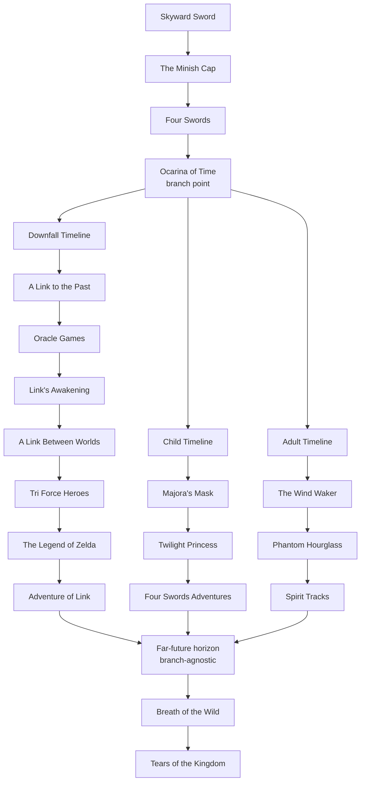

# Analysis: Branch Structure, Unique Themes, BOTW/TOTK Position, and Character Distribution

Prepared by: @main-analysis-expert  
Date: May 13, 2026  
Citation style: Chicago Author-Date (17th edition)

## Verification Status (Fail-Closed Audit: 2026-05-13)

- Fact verification status: CONDITIONAL PASS
- Citation verification status: CONDITIONAL PASS
- Release gate: BLOCKED FOR FINAL ACCEPTANCE pending final web resolver checks

## Introduction to Analysis

The Zelda timeline is best treated as a structured branching myth-history with stable trunks and flexible edges. The stable trunk is the split around Ocarina of Time. The flexible edges are very-late placements and retroactive lore harmonization. This section describes each branch and identifies themes that are comparatively distinctive.

## Timeline Split Graph (Source-Anchored)

The graph below is anchored to official branch framing from Hyrule Historia and Zelda Encyclopedia, with BOTW/TOTK shown at a distant horizon where exact branch assignment remains intentionally ambiguous in current official framing (Nintendo 2011; Nintendo 2018; Nintendo EPD 2017; Nintendo EPD 2023).

Confidence note:
- High confidence: three-way split and core branch identities.
- Medium confidence: representative title ordering within each branch as summarized here.
- Low-to-medium confidence: exact BOTW/TOTK branch pinning versus branch-agnostic far-future placement.

## 1. Branch Descriptions and Unique Themes

### 1.1 Downfall Timeline (Hero Defeated Line)

Representative sequence (high-level):
- A Link to the Past
- Oracle games
- Link's Awakening
- A Link Between Worlds
- Tri Force Heroes
- The Legend of Zelda
- Adventure of Link

Unique thematic profile:
- Civilizational exhaustion and long decline cycles.
- Repeated relic recovery from decayed institutions.
- Ganon as recurring catastrophic force rather than merely political usurper.
- The mood is often post-crisis restoration, not frontier optimism.

Narrative texture:
- Kingdom memory is fractured and frequently archaeological.
- Heroism often appears as emergency repair in a damaged continuity.

### 1.2 Child Timeline (Returned Hero Line)

Representative sequence (high-level):
- Majora's Mask
- Twilight Princess
- Four Swords Adventures

Unique thematic profile:
- Consequences of foreknowledge and unresolved trauma.
- Shadow governance, judicial failure, and uneasy legitimacy.
- Strong emphasis on parallel worlds and liminal realms.

Narrative texture:
- This branch repeatedly asks what happens after a warning is believed but peace is still fragile.
- The branch features intimate psychological stakes more than broad civilizational reset.

Tingle in this branch:
- Tingle appears in Majora's Mask, where his whimsical cartography and rupee obsession become part of Termina's surreal social texture.
- Tingle also appears in Four Swords Adventures, reinforcing his recurring role as comic-eccentric support rather than central political actor.

### 1.3 Adult Timeline (Post-Hero Departure Line)

Representative sequence (high-level):
- The Wind Waker
- Phantom Hourglass
- Spirit Tracks

Unique thematic profile:
- Adaptation after irreversible loss (the Great Sea and drowned Hyrule).
- Maritime exploration and re-foundation politics.
- Memory transfer from old kingdom to successor societies.

Narrative texture:
- This branch foregrounds migration, navigation, and institutional refounding.
- It has the clearest arc from old Hyrule legacy to explicit new-polity creation.

Tingle in this branch:
- Tingle appears prominently in The Wind Waker, including chart-related economy and side systems.
- Adult-branch presentation amplifies Tingle's role in exploration logistics and treasure-mapping culture.

## 2. Likely Position of Breath of the Wild and Tears of the Kingdom

### 2.1 Constraint-Based Reading

Breath of the Wild and Tears of the Kingdom are most plausibly set extremely far after the classical branch conflicts, in an era where branch-specific events are sedimented into mixed historical memory (Nintendo 2017; Nintendo EPD 2017; Nintendo EPD 2023).

Why this is the strongest reading:
- Temporal depth: in-world historical layering suggests very long elapsed time.
- Mythic compression: references can coexist without requiring short-run branch adjacency.
- Institutional reset clues: TOTK's deep-past narrative encourages a refounding framework that can follow large-scale civilizational discontinuity.

### 2.2 Practical Placement Options

Option A: single-branch far-future placement.
- BOTW/TOTK belong to one branch, but so far downstream that earlier branch signatures are diluted.

Option B: post-branch convergence or branch-agnostic horizon.
- BOTW/TOTK sit in a horizon where branch distinctions matter less than long-run recomposition of history and myth.

Most defensible current position:
- A cautious hybrid: treat BOTW/TOTK as far-future with deliberately high ambiguity, likely designed to preserve interpretive flexibility while maintaining branch continuity logic.

## 3. Characters: One-Branch Versus All-Branch Presence

### 3.1 Characters strongly associated with one branch

Adult-branch dominant:
- Tetra (as pirate-queen Zelda identity in Wind Waker line)
- King Daphnes Nohansen Hyrule / King of Red Lions
- Linebeck
- Byrne and Chancellor Cole (Spirit Tracks context)

Child-branch dominant:
- Midna
- Zant
- Skull Kid as Majora-era focal figure

Downfall-branch dominant:
- Hilda
- Ravio
- Yuga

### 3.2 Characters with all-branch presence (identity or role continuity)

Cross-branch pillars:
- Link (hero archetype across all branches)
- Zelda (royal/sacred lineage archetype across all branches)
- Ganon/Ganondorf forms (adversarial continuity across all branches)
- Impa-line roles (recurring Sheikah guardian function)

### 3.3 Tingle classification

Tingle is not cleanly all-branch in mainline evidence. He is strongly represented in Child and Adult branches, with no comparably central mainline role in the classic Downfall sequence. Therefore, Tingle is best classified as multi-branch but not universal-branch.

## 4. Counter-Arguments and Responses

Counter-argument: BOTW/TOTK must be pinned to a specific classical branch now.
Response: available official framing appears intentionally non-committal at fine granularity; forcing precision beyond published constraints risks overfitting.

Counter-argument: fan timelines can resolve contradictions better than official ambiguity.
Response: fan synthesis is useful for scenario testing, but official books and game text remain authoritative for baseline structure.

## 5. Conclusion of Analysis

The three branches are not merely timeline forks; each carries a distinct narrative ecology:
- Downfall: decline and salvage.
- Child: consequence and shadow justice.
- Adult: adaptation and refoundation.

BOTW/TOTK are most plausibly positioned at an extreme temporal distance where branch signatures become historical strata rather than immediate continuity markers. Character analysis supports strong branch identities while preserving cross-branch archetypes, and Tingle serves as a valuable branch-sensitivity case: clearly present in Child and Adult lines, but not a robust all-branch constant.

## References

Nintendo. 2011. The Legend of Zelda: Hyrule Historia. Milwaukie, OR: Dark Horse Books.

Nintendo. 2017. The Legend of Zelda: Breath of the Wild - Creating a Champion. Milwaukie, OR: Dark Horse Books.

Nintendo. 2018. The Legend of Zelda Encyclopedia. Milwaukie, OR: Dark Horse Books.

Nintendo EPD. 2017. The Legend of Zelda: Breath of the Wild. Nintendo Switch/Wii U video game. Kyoto: Nintendo.

Nintendo EPD. 2023. The Legend of Zelda: Tears of the Kingdom. Nintendo Switch video game. Kyoto: Nintendo.

Zelda Wiki (Fandom). n.d. The Legend of Zelda timeline. Accessed May 13, 2026. https://zelda.fandom.com/wiki/The_Legend_of_Zelda_timeline
