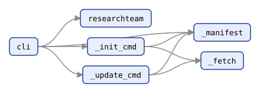
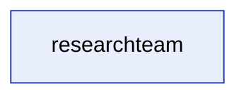

<!-- AGENTTEAMS:BEGIN content v=1 -->
# researchteam — Repository Architecture Map

> **Auto-generated.** Regenerated on every commit that touches the `researchteam` package. Do not edit manually — changes will be overwritten.

- Modules mapped: **6**
- Packages: **1**
- Internal import edges: **8**
- Distinct external dependencies: **0**

---

## Package Dependency Diagram

Inter-package import dependencies (module-level detail in the tables below).


---

## Packages

| Package | Modules | Depends on |
| --- | --- | --- |
| `researchteam` | 6 | — |

---

## Module Dependency Diagram

Every module, coloured by package (full adjacency in the table below).



---

## Module Dependency Table

| Module | Imports (internal) | Imported by |
| --- | --- | --- |
| `researchteam` | — | `researchteam.cli` |
| `researchteam._fetch` | — | `researchteam._init_cmd`, `researchteam._update_cmd` |
| `researchteam._init_cmd` | `researchteam._fetch`, `researchteam._manifest` | `researchteam.cli` |
| `researchteam._manifest` | — | `researchteam._init_cmd`, `researchteam._update_cmd`, `researchteam.cli` |
| `researchteam._update_cmd` | `researchteam._fetch`, `researchteam._manifest` | `researchteam.cli` |
| `researchteam.cli` | `researchteam`, `researchteam._init_cmd`, `researchteam._manifest`, `researchteam._update_cmd` | — |

---

## External Dependencies

Third-party (non-stdlib) top-level packages imported by the mapped package:

_None detected (standard library only)._

---

## Diagram Source

```dot
digraph "researchteam architecture" {
    rankdir=LR;
    node [fontname="Helvetica", fontsize=11, shape=box, style="rounded,filled", fillcolor="#eef6ee"];
    edge [fontsize=9];
    "researchteam" [fillcolor="#e8eefb"];
}
```

<details>
<summary>Mermaid &amp; DOT source for the diagram above</summary>





</details>

---

## JSON (module-level)

```json
{
  "root_package": "researchteam",
  "modules": {
    "researchteam": {
      "package": "researchteam",
      "path": "researchteam/__init__.py",
      "is_package": true,
      "imports_internal": [],
      "external": [],
      "repo_local": []
    },
    "researchteam._fetch": {
      "package": "researchteam",
      "path": "researchteam/_fetch.py",
      "is_package": false,
      "imports_internal": [],
      "external": [],
      "repo_local": []
    },
    "researchteam._init_cmd": {
      "package": "researchteam",
      "path": "researchteam/_init_cmd.py",
      "is_package": false,
      "imports_internal": [
        "researchteam._fetch",
        "researchteam._manifest"
      ],
      "external": [],
      "repo_local": []
    },
    "researchteam._manifest": {
      "package": "researchteam",
      "path": "researchteam/_manifest.py",
      "is_package": false,
      "imports_internal": [],
      "external": [],
      "repo_local": []
    },
    "researchteam._update_cmd": {
      "package": "researchteam",
      "path": "researchteam/_update_cmd.py",
      "is_package": false,
      "imports_internal": [
        "researchteam._fetch",
        "researchteam._manifest"
      ],
      "external": [],
      "repo_local": []
    },
    "researchteam.cli": {
      "package": "researchteam",
      "path": "researchteam/cli.py",
      "is_package": false,
      "imports_internal": [
        "researchteam",
        "researchteam._init_cmd",
        "researchteam._manifest",
        "researchteam._update_cmd"
      ],
      "external": [],
      "repo_local": []
    }
  },
  "package_edges": [],
  "module_edges": [
    {
      "source": "researchteam._init_cmd",
      "target": "researchteam._fetch"
    },
    {
      "source": "researchteam._init_cmd",
      "target": "researchteam._manifest"
    },
    {
      "source": "researchteam._update_cmd",
      "target": "researchteam._fetch"
    },
    {
      "source": "researchteam._update_cmd",
      "target": "researchteam._manifest"
    },
    {
      "source": "researchteam.cli",
      "target": "researchteam"
    },
    {
      "source": "researchteam.cli",
      "target": "researchteam._init_cmd"
    },
    {
      "source": "researchteam.cli",
      "target": "researchteam._manifest"
    },
    {
      "source": "researchteam.cli",
      "target": "researchteam._update_cmd"
    }
  ],
  "external_dependencies": [],
  "repo_local_dependencies": []
}
```
<!-- AGENTTEAMS:END content -->
